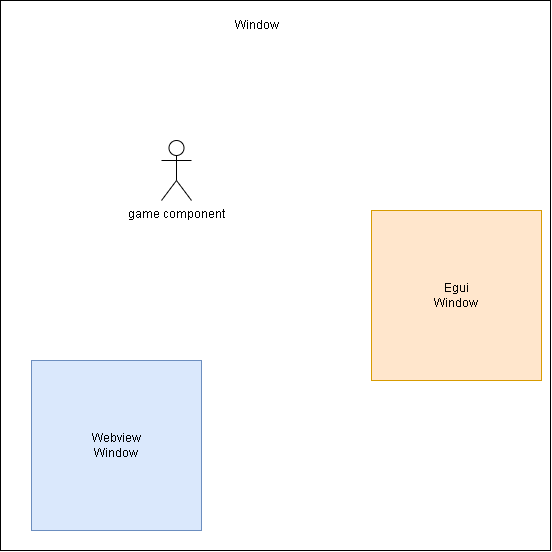

# bevy_flurx_wry

> [!CAUTION]
> This crate is in the early stages of development and is subject to disruptive changes.

[examples/count_up.rs](examples/count_up.rs)


## Purpose

The purpose of this crate is integrate [bevy](https://github.com/bevyengine/bevy) and [wry](https://github.com/tauri-apps/wry) using [bevy_flurx](https://github.com/not-elm/bevy_flurx).

I assume three ways to use Webview.

### 1. Create the entire primary window a webview

I honestly think [tauri](https://tauri.app/) is more practical this way...


### 2. Create two windows: a bevy window and a webview window

Please Check [sub_window.rs](examples/sub_window.rs).


### 3. Create webview as child window

Create a webview window in the PrimaryWindow, as in [bevy_egui](https://github.com/mvlabat/bevy_egui).

This usage would be the most in demand, but unfortunately it is not feasible at this time because there is no way to create a child window.

Fortunately, this issue has been raised in [here](https://github.com/bevyengine/bevy/issues/13194) and may be resolved in the future.




## Ipc

As with `tauri`, webview and `bevy` worlds communicate via ipc.

Use `bevy_flurx` actions for ipc communication.

`Action` is a very powerful feature that allows you to access bevy resources, run asynchronous runtimes, and much more.
It can also be combined into a single action.

for example, to retrieve a player's name, retrieve a score from the server based on that name, and return it as the output of an action, as in the following implementation
The return value of this action is the return value of the webview side.


```rust

use bevy::prelude::*;
use bevy_flurx::prelude::*;
use bevy_flurx_wry::prelude::*;

#[derive(Component)]
struct PlayerName(String);

#[command]
fn score() -> ActionSeed<(), usize>{
    once::run(get_player_name)
        .pipe(effect::tokio::spawn(|player_name: String| async move{
            let score: usize = reqwest::get(format!("https://example_api/score?player_name={player_name}"))
                .await
                .unwrap()
                .text()
                .await
                .unwrap()
                .parse()
                .unwrap();
            score
        }))
}

fn get_player_name(players: Query<&PlayerName>) -> String{
    players.single().0.to_string()
}
```
